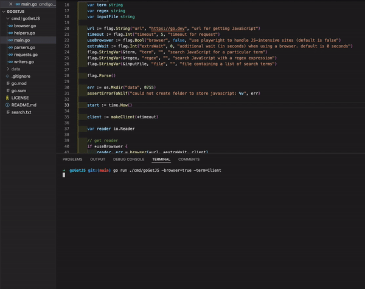

# goGetJS
[](http://opensource.org/licenses/MIT)
[](https://goreportcard.com/report/github.com/davemolk/goGetJS)
[](https://github.com/davemolk/goGetJS/issues)

goGetJS extracts, searches, and saves JavaScript files. Includes an optional chromium headless browser (playwright) for dealing with JavaScript-heavy sites.



## Overview
* goGetJS scrapes a given page for script tags, visits each src, and writes the contents to an individual file.
* If a script tag doesn't include an src attribute, goGetJS scrapes everything between the script tags and writes the contents to an individual file.
* All src are also saved to a text file.
* goGetJS (optionally) uses playwright to handle JavaScript-heavy sites and retrieve async scripts. Use -b.
* Add some extra waiting time with -ew to allow the network to settle and grab those longer loading async scripts.
* Use -term, -regex, and -terms, respectively, to scan each script for a specific word, with a regular expression, or with a list of words (input as a file).
* goGetJS does not follow redirects by default, but this can be toggled with -redirect=true.

## Example Usages (use browser and search each script for a list of terms in search.txt)
```
go run ./cmd/goGetJS -u https://go.dev -b -terms search.txt
```
```
echo https://go.dev | goGetJS -b -terms search.txt
```

## Command-line Options
```
Usage of goGetJS:
  -b bool
    	Use chromium headless browser (powered by playwright). Default is false.
  -bt int
    	Timeout for headless browser. Default is 10000 ms. Must also activate browser via -b.
  -ew int
    	Playwright considers a page loaded after the network has been idle for at least 500ms. Use this flag (in ms) to add time. 
  -proxy string
    	Proxy to use on requests.
  -redirect bool
    	Allow redirects. Default is false.
  -regex string
    	Parse each script for the supplied regular expression. Any matches will be saved and exported as a json file.
  -rt int
    	Timeout for retries. Default is 1000ms.
  -t int
    	Request timeout (in milliseconds). Default is 5000.
  -term	string
        Parse each script for the supplied word. Any matches will be saved and exported as a json file.
  -terms string
    	Name of .txt file containing a list of search terms (one per line). Any matches will be saved and exported as a json file. 
  -u string
    	URL to extract JS files from.
```

## Installation
First, you'll need to [install go](https://golang.org/doc/install).

Then run this command to download + compile goGetJS:
```
go install github.com/davemolk/goGetJS/cmd/goGetJS@latest
```

## Additional Notes
* goGetJS names JavaScript files with ```fName := regexp.MustCompile(`[\w-&]+(\.js)?$`)```. Most scripts play nice, but those that don't are still saved. Each saved script has the full URL prepended to the file.
* Occasionally, an src will link to an empty page. These are automatically retried (set a timeout for these retries with -rt). Typically, these pages are legitimately blank, causing the number of saved files printed to the terminal to be fewer than the number of processed files. Sometimes we're lucky though, and the successful retry will be searched and saved.

## Changelog
*    **2022-09-15** : Release 1.0. 
*    **2022-08-26** : Add proxy, redirect, and rt flags. Refactor client creation. Improve error handling throughout. 
*    **2022-08-20** : Move from %v to %w for handling errors with fmt.Errorf. Move everything to milliseconds.

## Support
* Like goGetJS? Use it, star it, and share with your friends!
    - Let me know what you're up to so I can feature your work here.
* Want to see a particular feature? Found a bug? Question about usage or documentation?
    - Please raise an issue.
* Pull request?
    - Please discuss in an issue first. 

## Built With
* https://github.com/PuerkitoBio/goquery
* https://github.com/playwright-community/playwright-go

## License
* goGetJS is released under the MIT license. See [LICENSE](LICENSE) for details.